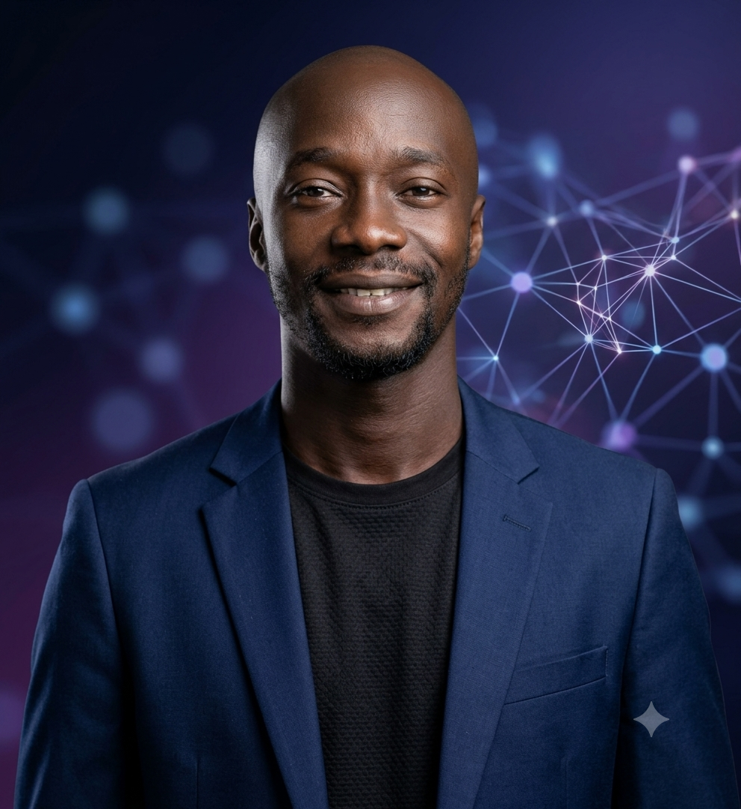

# 🚀 Assane Gassama - Portfolio Personnel



Bienvenue sur le code source de mon portfolio professionnel. Je suis **Assane Gassama**, un **Data Scientist, AI Engineer & AgriTech**, passionné par les données et l'agronomie.

## 🌟 À propos

Ce projet est un portfolio interactif développé pour présenter mon parcours, mes compétences, mes certifications et mes projets. Il a été conçu de manière moderne et cinématographique avec une très grande exigence sur l'UI/UX.

### 💼 Mon Profil
- **Expertises** : Data Science, Intelligence Artificielle (AI), Data Engineering, Analyse de Données, Agronomie.
- **Localisation** : Yeumbeul, Keur Massar, Dakar, Sénégal.
- **Contact** : [assanegassama1999@gmail.com](mailto:assanegassama1999@gmail.com)
- **Portfolio en ligne** : [assanegassama.dev](https://assanegassama.dev)

## 🛠 Technologies utilisées

Ce portfolio est construit avec les dernières technologies du web pour assurer une performance maximale et une expérience utilisateur fluide :

- **Framework** : [Next.js 14](https://nextjs.org/) (App Router)
- **UI & Styling** : [Tailwind CSS](https://tailwindcss.com/)
- **Animations** : [Framer Motion](https://www.framer.com/motion/) & [GSAP](https://gsap.com/)
- **Formulaire de contact** : FormSubmit (sans backend, directement lié à ma messagerie)

## 🚀 Lancer le projet en local

Si vous souhaitez explorer le code en local sur votre machine, suivez ces étapes :

1. Clonez le dépôt :
   ```bash
   git clone https://github.com/GassamaAssane/Gassama-Assane-Portofolio.git
   ```
2. Installez les dépendances :
   ```bash
   npm install
   ```
3. Lancez le serveur de développement :
   ```bash
   npm run dev
   ```
4. Ouvrez [http://localhost:3000](http://localhost:3000) dans votre navigateur.

---
*Fait avec ❤️ par Assane Gassama.*
